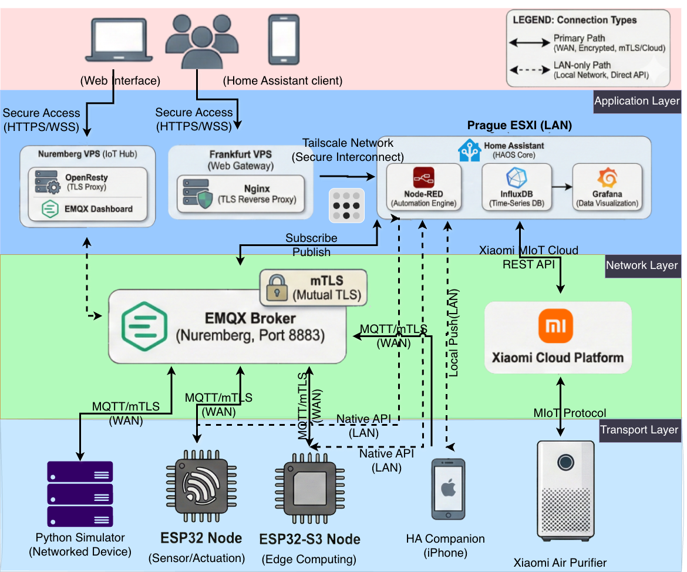
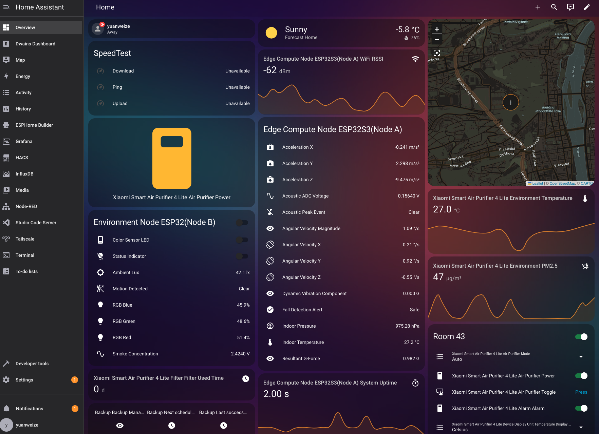
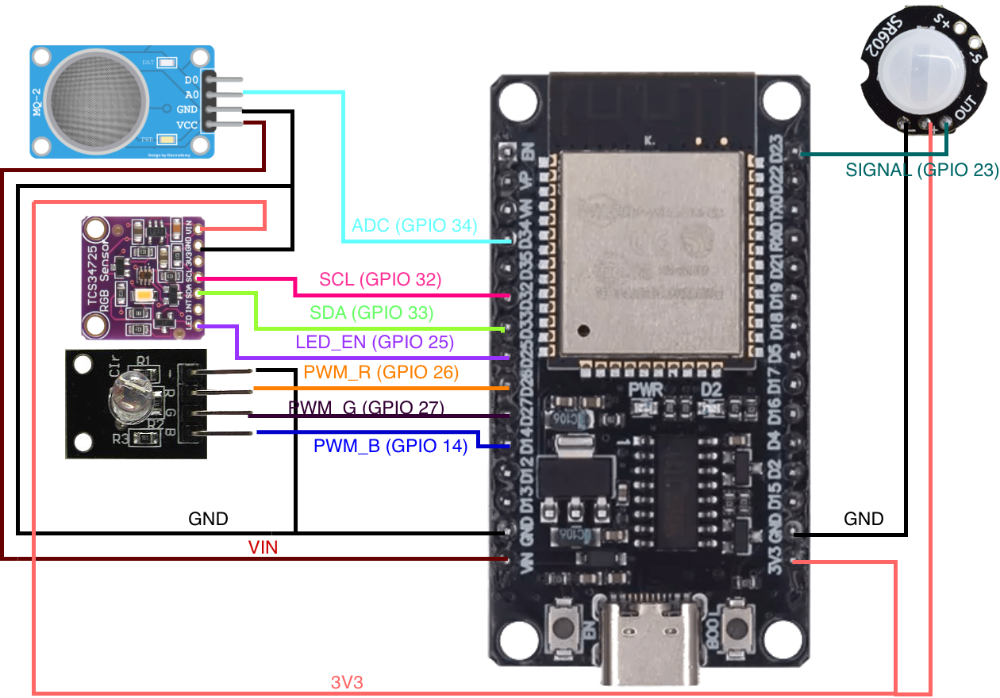

# SmartHome Server

语言：**简体中文** | [English](README.md)

面向论文研究的智能家居 IoT 平台，支持 MQTT 传感器/执行器流量模拟与基准测试，具备 mTLS 双向认证能力。可与 Home Assistant 集成，适用于安全研究和可扩展性测试。

> **学术项目：** 本仓库为捷克理工大学电气工程学院学士论文《服务器与类 Unix 系统在智能家居传感器控制中的应用》的配套代码。

<div align="center">
  
  <p><em>SmartHome Server 系统架构 — 双向 mTLS MQTT 传输、高可用 Broker 拓扑、大规模传感器模拟集群与 Home Assistant 控制中台</em></p>
</div>

## 论文

| 资源 | 链接 |
|------|------|
| **在线阅读** | [](docs/BT/Yuan_Weize_Bachelor_Thesis_latest.pdf) |
| **下载 Release** | [](https://github.com/yuanweize/SmartHome_Server/releases/latest) |
| 导师评审报告 | [supervisor_report.pdf](docs/BT/Review/supervisor_report.pdf) |
| 对手评审报告 | [opponent_report_Koller.pdf](docs/BT/Review/opponent_report_Koller.pdf) |
| 答辩记录 | [Prubeh-obhajoby.pdf](docs/BT/Review/Prubeh-obhajoby.pdf) |
| 官方存档 | [CTU 数字图书馆 (DSpace)](https://hdl.handle.net/10467/178631) |

## 仓库结构

```
SmartHome_Server/
├── sensors/                # Python MQTT 模拟器包
│   └── smarthome_sim/      # 核心库
├── broker/                 # MQTT Broker 配置
│   ├── emqx/               # EMQX Docker（含 mTLS）
│   └── mosquitto/          # Mosquitto Docker 备选
├── homeassistant/          # Home Assistant 参考
├── esphome/                # ESP32/ESP32-S3 固件配置
├── certs/                  # TLS/mTLS 证书生成脚本
├── docs/                   # 文档与论文
│   ├── BT/                 # 学士论文（LaTeX 源码、评审、图表）
│   ├── pdf2md/             # Datasheet 转 Markdown 工具
│   ├── thesis_doc/         # 论文草稿与笔记（存档）
└── ...
```

## 快速开始

### 1. 克隆与环境配置

```bash
git clone https://github.com/yuanweize/SmartHome_Server.git
cd SmartHome_Server
python3 -m venv .venv && source .venv/bin/activate
pip install -r sensors/requirements.txt
```

### 2. 配置并运行模拟器

```bash
cp sensors/brokers.example.yml sensors/brokers.yml
# 编辑 brokers.yml，填入你的 MQTT Broker 信息

# 演练模式（无需 Broker）
python sensors/sensor_simulator.py --dry-run

# 启用 Home Assistant 自动发现
python sensors/sensor_simulator.py --ha-discovery
```

### 3. 部署 MQTT Broker（可选）

```bash
cd broker/emqx && docker compose up -d
```

## 功能特性

| 组件 | 描述 |
|------|------|
| **smarthome_sim** | 多 Broker MQTT 模拟器，支持多种实体模型（漂移、正弦、运动检测） |
| **mTLS 安全** | 基于 ECDSA P-256 的双向证书认证 |
| **HA 集成** | 传感器、开关、灯光的自动发现 |
| **基准测试** | TLS 握手延迟测量及统计分析 |
| **可扩展性** | 多进程模式支持数千台模拟设备 |

<div align="center">
  
  <p><em>Home Assistant 统一监控控制台 — 实时汇总呈现虚拟仿真与物理边缘遥测数据（温湿度漂移、雷达跌倒监测、执行器开关）</em></p>
</div>

<div align="center">
  
  <p><em>物理边缘硬件验证 — ESP32 传感器接线拓扑与毫米波雷达跌倒检测硬件电路</em></p>
</div>

## 文档索引

| 目录 | 描述 |
|------|------|
| [sensors/README.zh-CN.md](sensors/README.zh-CN.md) | 模拟器使用与配置 |
| [certs/README.zh-CN.md](certs/README.zh-CN.md) | 证书生成指南 |
| [homeassistant/README.zh-CN.md](homeassistant/README.zh-CN.md) | Home Assistant 部署 |
| [docs/BT/CTU_FEL_THESIS/README.md](docs/BT/CTU_FEL_THESIS/README.md) | 论文 LaTeX 源码 |

## 环境要求

- Python 3.8+
- Docker & Docker Compose（用于 Broker/HA 部署）
- OpenSSL（用于证书生成）

## 许可证

本项目采用 [MIT 许可证](LICENSE)。

## 引用

如在学术工作中使用本项目，请引用：

```bibtex
@thesis{yuan2026smarthome,
    author  = {Yuan, Weize},
    title   = {Application of Servers and Unix-like Systems for Sensor Control in Smart Homes},
    school  = {Czech Technical University in Prague, Faculty of Electrical Engineering},
    year    = {2026},
    url     = {https://hdl.handle.net/10467/178631}
}
```

**永久链接 (Permanent Link):** [https://hdl.handle.net/10467/178631](https://hdl.handle.net/10467/178631)

## 致谢

本项目在捷克理工大学电气工程学院微电子系 [prof. Ing. Miroslav Husák, CSc.](https://fel.cvut.cz/en/faculty/people/966-miroslav-husak) 的指导下完成。

## 作者

**袁玮泽 (Weize Yuan)**  
*电气工程与计算机科学 (EECS)*  
捷克理工大学电气工程学院

[](https://github.com/yuanweize)
